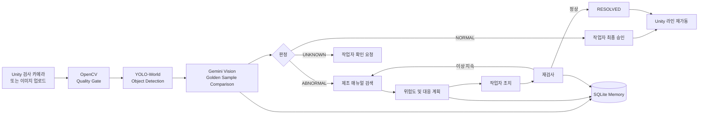

# AutoMate

자동차 조립공정 이미지를 검사하고, 이상 상황의 위험도와 대응 절차를 제안한 뒤 재검사까지 수행하는 제조·피지컬 AI Agent MVP입니다.

제4회 경남 AI 공모전 참가 프로젝트 · 이현재

## 핵심 기능

- 실제 이미지 업로드 및 Unity 디지털 트윈 검사 카메라 연동
- OpenCV 이미지 품질 검사
- YOLO-World 차량·부품 탐지
- Gemini Multimodal Vision 및 정상 골든 샘플 비교
- 제조 매뉴얼 검색과 위험도·대응 계획 생성
- Human-in-the-loop 작업자 승인
- 조치 후 재검사와 `RESOLVED` 상태 처리
- SQLite 검사 이력 및 5개 테스트 케이스 평가
- Python Agent 판정에 따른 Unity 신호등·생산 라인 제어

## Agent 구조



## 실행 준비

Python 3.12 가상환경을 사용합니다.

```bash
source .venv/bin/activate
pip install -r requirements.txt
```

`.env.example`을 참고해 `.env`를 설정합니다.

```dotenv
GEMINI_API_KEY=your_gemini_api_key_here
GEMINI_MODEL=gemini-3.5-flash-lite
YOLO_ENABLED=true
YOLO_MODEL=yolov8s-worldv2.pt
YOLO_CONFIDENCE=0.15
```

API 키는 `.gitignore`에 포함된 `.env`에만 저장합니다.

## Streamlit 실행

```bash
source .venv/bin/activate
python -m streamlit run app.py
```

## Unity 실행

1. Unity Hub에서 `unity/AutoMateSimulation` 프로젝트를 엽니다.
2. `Assets → Refresh`를 실행합니다.
3. `AutoMate → Build Assembly Line Demo`를 실행합니다.
4. `Game` 탭에서 Play를 누릅니다.
5. 왼쪽 아래에서 테스트 시나리오를 선택합니다.

차량이 검사 위치에 멈추면 `unity_captures/`에 이미지가 저장됩니다. Streamlit 분석 결과는 `unity_bridge/`를 통해 Unity로 전달됩니다.

## 테스트 케이스

| ID | 입력 | 기대 결과 |
|---|---|---|
| TC01 | 정상 차량 | `NORMAL`, `LOW` |
| TC02 | 휠 누락 | `ABNORMAL`, `HIGH/CRITICAL` |
| TC03 | 헤드라이트 누락 | `ABNORMAL`, `HIGH` |
| TC04 | 도어 조립 이상 | `ABNORMAL`, `HIGH` |
| TC05 | 가려진 카메라 | `UNKNOWN`, 작업자 확인 요청 |

테스트 시나리오 파일명은 검사 완료 후 평가에만 사용하며 Vision 모델의 입력이나 판정 근거로 전달하지 않습니다.

### 대표 검증 결과

| ID | 실제 판정 | 결함 | 위험도 | 결과 |
|---|---|---|---|---|
| TC01 | `NORMAL` | `none` | `LOW` | PASS |
| TC02 | `ABNORMAL` | `wheel_missing` | `CRITICAL` | PASS |
| TC03 | `ABNORMAL` | `headlight_missing` | `HIGH` | PASS |
| TC04 | `ABNORMAL` | `door_assembly_defect` | `HIGH` | PASS |
| TC05 | `UNKNOWN` | `image_quality_too_low` | `UNKNOWN` | PASS |

대표 시나리오 5건의 기능 검증 결과는 5/5 PASS입니다. 이는 대회용 대표 시나리오 결과이며 실제 산업 현장 전체에 대한 일반화 정확도를 의미하지 않습니다.

## 주요 파일

| 파일 | 역할 |
|---|---|
| `app.py` | Streamlit UI, Agent Workflow, Gemini, 매뉴얼, SQLite, Unity 브리지 |
| `vision/yolo_detector.py` | YOLO-World 탐지 도구 |
| `vision/image_quality.py` | OpenCV 밝기·선명도 품질 검사 |
| `vision/rule_engine.py` | 탐지 결과 기반 다음 도구 선택 |
| `manuals.json` | MVP용 제조 매뉴얼 데이터 |
| `automate.db` | 검사·재검사 상태 저장 SQLite DB |
| `unity/AutoMateSimulation` | 생산 라인 디지털 트윈 |
| `docs/DEMO_GUIDE.md` | 심사 발표용 상세 시연 순서 |
| `docs/DEMO_VIDEO_3MIN.md` | 3분 실제 동작 영상 촬영 대본 |

## 안전 정책

AI가 정상으로 판단해도 생산 라인을 자동 승인하지 않습니다. 작업자가 Streamlit에서 승인해야 Unity 차량이 이동합니다. 이상 또는 불확실 판정에서는 라인을 정지하고 작업자 확인과 재검사를 요구합니다.
